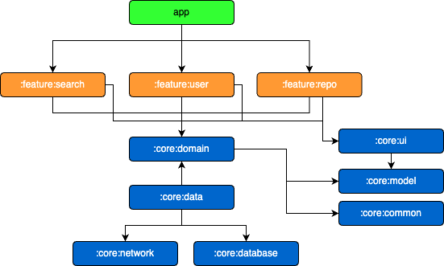

# Android 샘플앱 만들기

Android 샘플앱을 만들어보자!!

생각나는 기술 스택들을 모아서 쓸 수 있는 것들은 사용해보자!!

무엇을 만들지는 그 다음?

## 1. 어떤 것들이 있는지?

Kotlin, MVVM, Coroutine, Flow, Compose, Hilt, Retrofit, Moshi, Coil,  Room, JUnit, Paging, Navigation

그리고 이런것도 넣어볼까?

WorkManager,

## 2. 무엇을 만들지?

간단히 API 로 데이터를 불러와서 로드하는 리스트 화면을 만들자

리스트에서 상세로 전환되는 화면도 있다면 좋겠지?

즐겨찾기 기능도 있으면 좋을듯?

간단히 사용할 수 있는 github API가 있으니 이걸로 먼저 생각해보자.

- [Search Users - GitHub Docs](https://docs.github.com/ko/rest/search/search?apiVersion=2022-11-28#search-users)

- [Search Repositories - GitHub Docs](https://docs.github.com/ko/rest/search/search?apiVersion=2022-11-28#search-repositories)

- [Search Code - GitHub Docs](https://docs.github.com/ko/rest/search/search?apiVersion=2022-11-28#search-code)

메인에서 검색어 입력 받은 후 User 및 Repo 검색을 함. 카드에서 구분이 가능하게 리스트 표현.

User 카드 선택시 User의 Repo 리스트 화면으로

Repo 카드 선택시 Repo 상세 화면으로

API 로딩시 Room 에 캐쉬 데이터가 있으면 먼저 노출 후 로딩 중 표시. 로딩 완료시 API 데이터로 업데이트.

User 카드, Repo 카드, User화면, Repo 화면에서 즐겨찾기 기능 제공.

메인에서 즐겨찾기 버튼 누르면 즐겨찾기 리스트 화면으로

결국 화면은

- 메인 (+통합 검색결과)

- 유저 (+유저 검색결과)

- 유저별 레포 (+레포 검색결과)

- 레포 상세 (데이터는 이전에서 들고 옴, 또는 id만 들고와서 Room에서 로딩)

- 즐겨찾기

## 3. 어떻게 만들까?

MVVM으로 만들자 (+Clean Architecture)

테스트도 붙여보자.

멀티모듈로 만들어보자.

### 3.1. 모듈화 전략은?

- NowInAndroid의 모듈화 전략을 참고해봐야 겠음.
  [NIA 모듈화 전략](https://github.com/android/nowinandroid/blob/main/docs/ModularizationLearningJourney.md)
  
  - 크게 app, feature, core로 구분되어 있음. (문서에서는 app, feature, data로 나누긴 함)
  
  - 안드 권장 아키텍처다보니 domain이 data에 대해 종속성을 가짐.

- NIA에는 없지만 문서에서는 추상화 모듈을 만들라하기는 함.
  
  

- 간단하게 Clean Architecture 형식으로 가보기로 함.
  
  - app -> ui -> domain <- data <- datasource
    
    - app : domain 모듈을 바라보며, ui 모듈을 사용함.
    
    - feature (Composable & ViewModel)
      
      - user
      
      - repo
      
      - search
    
    - core
      
      - common : 공통 유틸성 모음.
      
      - model : 앱에서 사용할 데이터 모델. 
      
      - domain : usecase 모음. repository interface를 가짐. 함.
      
      - data :  repository impl 을 가짐. repository에서 entity, dto를 model로 mapping 처리함
      
      - ui : compose 함수 모음. 복잡한 UI가 많아진다면 기본 design 관련 모듈 추가하고 사용해도 됨.
      
      - database : room
      
      - network : retrofit

